<!-- Improved compatibility of back to top link: See: https://github.com/othneildrew/Best-README-Template/pull/73 -->
<a name="readme-top"></a>
<!--
*** Thanks for checking out the Best-README-Template. If you have a suggestion
*** that would make this better, please fork the repo and create a pull request
*** or simply open an issue with the tag "enhancement".
*** Don't forget to give the project a star!
*** Thanks again! Now go create something AMAZING! :D
-->

<!-- PROJECT SHIELDS -->
<!--
*** I'm using markdown "reference style" links for readability.
*** Reference links are enclosed in brackets [ ] instead of parentheses ( ).
*** See the bottom of this document for the declaration of the reference variables
*** for contributors-url, forks-url, etc. This is an optional, concise syntax you may use.
*** https://www.markdownguide.org/basic-syntax/#reference-style-links
-->

<!-- PROJECT LOGO -->
<h3 align="center">BreweryList</h3>

  <p align="center">
    A CRUD Application for Breweries
  </p>

<!-- TABLE OF CONTENTS -->
<details>
  <summary>Table of Contents</summary>
  <ol>
    <li>
      <a href="#about-the-project">About The Project</a>
      <ul>
        <li><a href="#built-with">Built With</a></li>
      </ul>
    </li>
    <li>
      <a href="#getting-started">Getting Started</a>
        <ul>
          <li><a href="#prerequisites">Prerequisites</a></li>
          <li><a href="#installation">Installation</a></li>
          <li><a href="#initial-setup">Initial Setup</a></li>
      </ul>
    </li>
    <li><a href="#usage">Usage</a>
      <ul>
          <li><a href="#fetching-and-resetting-data">Fetching/Resetting Data</a></li>
          <li><a href="#viewing-all-brewery-details">Viewing All Brewery Details</a></li>
          <li><a href="#creating-a-brewery">Creating a Brewery</a></li>
          <li><a href="#editing-a-brewery">Editing a Brewery</a></li>
          <li><a href="#deleting-a-brewery">Deleting a Brewery</a></li>
          <li><a href="#searching-the-list">Searching the List</a></li>
      </ul>
    </li>
    <li><a href="#acknowledgments">Acknowledgments</a></li>
  </ol>
</details>

<!-- ABOUT THE PROJECT -->
## About The Project


<div style="display: flex; align-items: center"> 
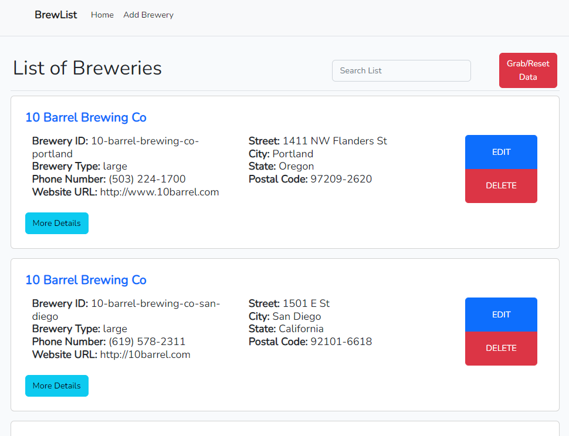
</div>
<br/>
Full-stack CRUD application for keeping track of breweries. 

<p align="right">(<a href="#readme-top">back to top</a>)</p>

### Built With
* Built the website using VueJS with Bootstrap for styles.
* Backend API was built with Laravel using Eloquent ORM.
* Utilized data from open source API to fetch initial data.
<br/>
<a href="https://api.openbrewerydb.org/"><strong>Link to Open Source Brewery API</strong></a>


<p align="right">(<a href="#readme-top">back to top</a>)</p>


<!-- GETTING STARTED -->
## Getting Started

This application is NOT hosted or deployed yet! Please follow the instructions below to locally deploy and use.
<!-- <br/>
<a href="https://dangthuy112.github.io/Wordle-with-React/"><strong>Link to Website</strong></a> -->
### Prerequisites

1. You will need NodeJS and npm installed.
<a href="https://nodejs.org/en/download/">NodeJS Download Link</a>
<br/> 
To install the latest latest npm version:

  ```sh
  npm install npm@latest -g
  ```

2. PHP (this can be installed along with XAMPP)
3. XAMPP needs to be installed in order to locally utilize the Apache server and MySQL database. XAMPP can also install PHP if it's not already installed.
<br/>
<a href="https://www.apachefriends.org/">XAMPP Download Link</a>
<br/> 


### Installation

1. Clone the repo
   ```sh
   git clone https://github.com/dangthuy112/brewerylist
   ```
2. Install NPM packages
   ```sh
   npm install
   ```


### Initial Setup

1. Start XAMPP and click Start on MySQL and Apache(MySQL has to be using port 3306)
<br/>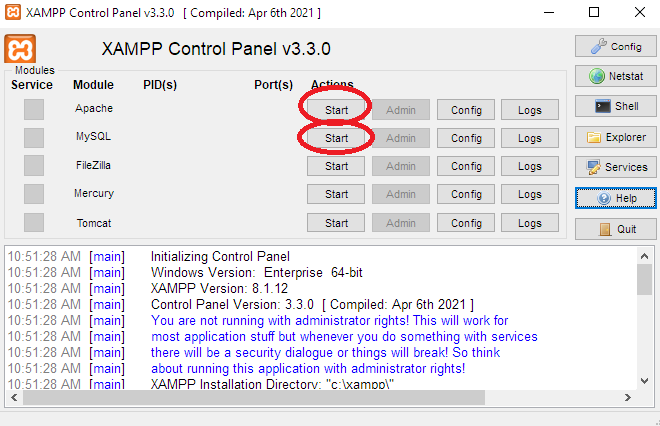

2. Click on admin to navigate to localhost/phpmyadmin
<br/>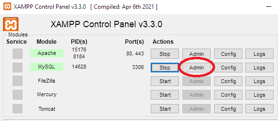

3. Create a new database name "laravelbreweries" with utf8mb4_general_ci
<br/>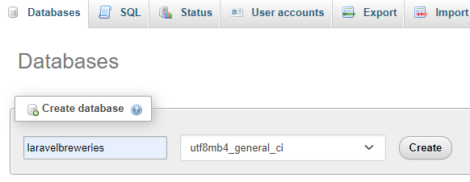

4. Go to .env file. Set DB_DATABASE to laravelbreweries
   ```sh
    DB_DATABASE=laravelbreweries
5. Go to terminal. Navigate to directory of brewerylist and migrate tables
   ```sh
    php artisan migrate:fresh
   ```
6. Go to terminal. Start the vite development mode
   ```sh
    npm run dev
   ```
7. Open ANOTHER terminal. Start the php server
   ```sh
    php artisan serve
   ```
8. Navigate to http://127.0.0.1:8000/ in browser for the website

<p align="right">(<a href="#readme-top">back to top</a>)</p>


<!-- USAGE EXAMPLES -->
## Usage


1. ### Fetching and Resetting Data
The database will be empty to start. Press the "Grab/Reset Data" button to fetch data from API.
<br/>
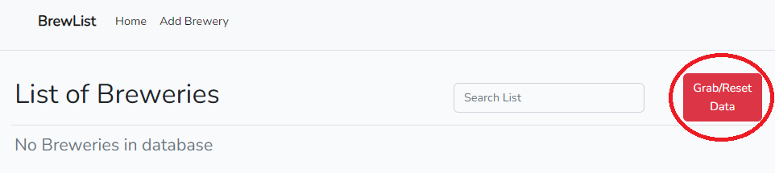
<br/>
On top of initially fetching data. This feature also resets the database by wiping all data and fetching from API again.
<br/>
This allows for more testing with the database by resetting it to a default state. But be careful not to wipe any valuable data.


2. ### Viewing All Brewery Details
Click on the "More Details" button to navigate to specific brewery to view the full details. 
<br/>
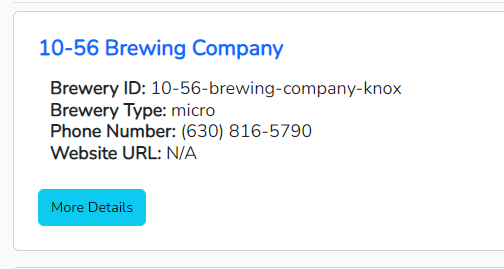
<br/>
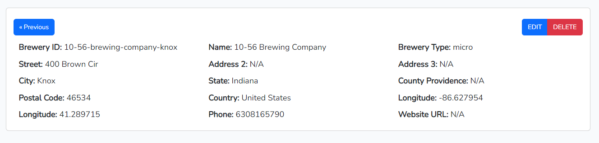
<br/>

3. ### Creating a Brewery
Click on Add Brewery in the header to navigate to the add brewery page.
<br/>
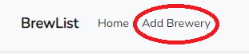
<br/>
Fill out the form and press "SUBMIT" to add a brewery to the database
<br/>
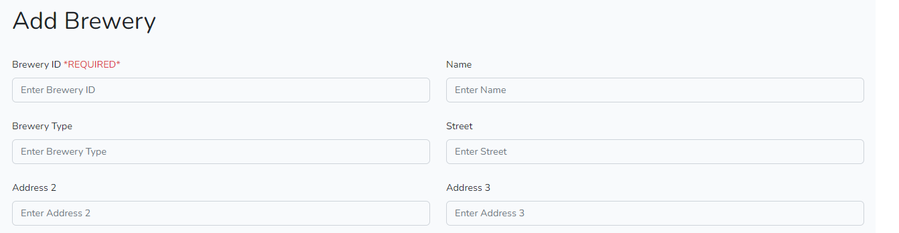
<br/>
<br/>
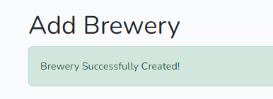
<br/>

4. ### Editing a Brewery
Clicking the "EDIT" button on specific brewery from the More Details page or directly from the list will redirect to the Edit Brewery page.
<br/>
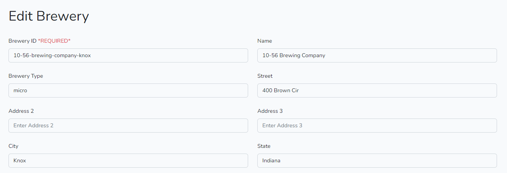
<br/>
Fill out the form and press "SUBMIT" to update the brewery to the database
<br/>

5. ### Deleting a Brewery
Clicking the "DELETE" button on specific brewery from the More Details page or directly from the list will redirect to confirm the deletion of that brewery.
<br/>
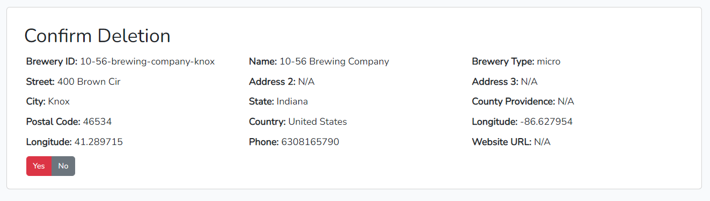
<br/>
Clicking "Yes" will confirm the deletion and "No" will direct back to the list.
<br/>

6. ### Searching the List
Typing in the search box will filter the list and match with breweries's brewery id, name, type, street, city, state, postal code, phone number and website.
<br/>
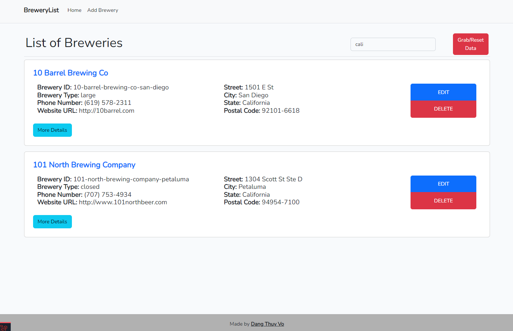
<br/>

<p align="right">(<a href="#readme-top">back to top</a>)</p>


<!-- CONTACT -->
## Contact

Dang Thuy Vo - dangthuy112@gmail.com
Project Link: [https://github.com/dangthuy112/brewerylist](https://github.com/dangthuy112/brewerylist)

<p align="right">(<a href="#readme-top">back to top</a>)</p>


<!-- ACKNOWLEDGMENTS -->
## Acknowledgments

* [Udemy](https://www.udemy.com/course/master-laravel-6-with-vuejs-fullstack-development/)
* [Laravel Documentation](https://laravel.com/docs/9.x/eloquent)
* [VueJS Documentation](https://vuejs.org/guide/introduction.html)
* [Bootstrap Documentation](https://getbootstrap.com/docs/5.0/getting-started/introduction/)

<p align="right">(<a href="#readme-top">back to top</a>)</p>


